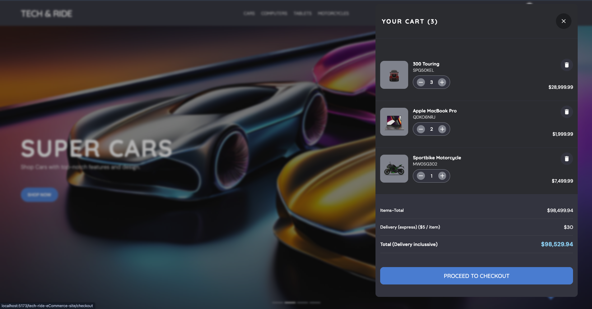
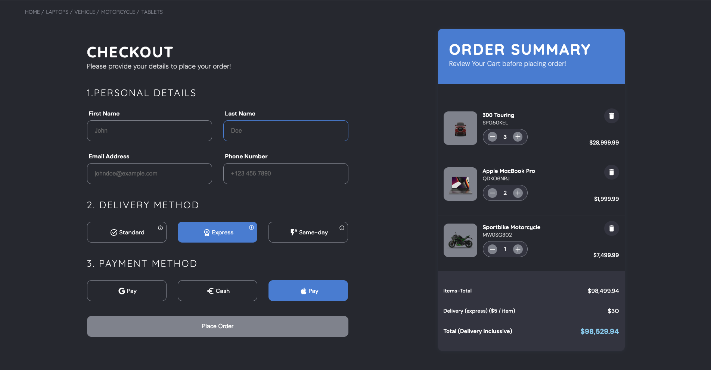
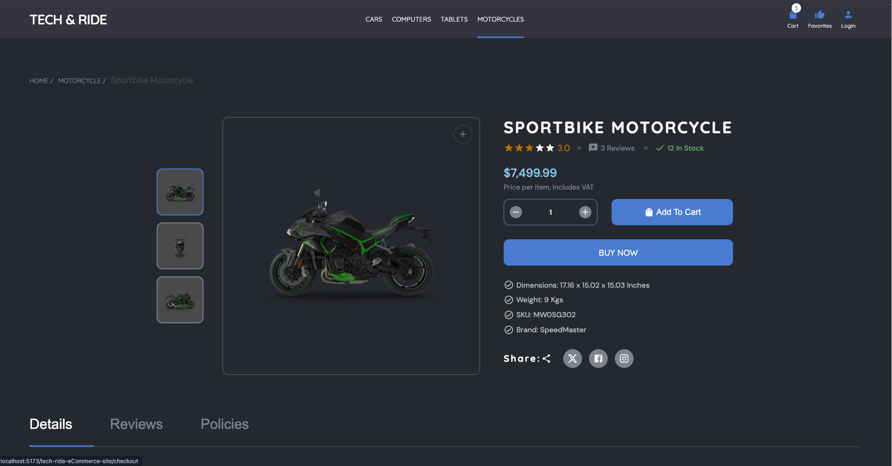

 **Tech & Ride eCommerce Site** project:



# Tech & Ride eCommerce Site

## Motivation
The **Tech & Ride eCommerce Site** was built to showcase a practical and responsive front-end eCommerce application. The primary motivation behind this project was to strengthen skills in ReactJS, state management, responsive design, and component-based architecture. The site represents a company that sells a variety of tech products, including computers, smartphones, motorcycles, and tablets. This project highlights core features such as dynamic routing, shopping cart functionality, product details pages, and an accessible, user-friendly interface.

The project also integrates modern tools like Material UI for styling, Framer Motion for animations, and Vite as the build tool, demonstrating the usage of popular libraries and efficient development practices.

---

## Features

- **Responsive Design**: Fully responsive across devices, with a layout optimized for smartphones, tablets, and desktops.
- **Dynamic Routing**: Routes dynamically handle different product categories and individual product details using React Router.
- **Shopping Cart**: Includes cart functionality with the ability to add, remove, and adjust quantities of items. Cart state is managed globally using the Context API.
- **Favorites**: Allows users to mark products as favorites and view them in a dedicated section.
- **Product Detail Pages**: Detailed pages for each product showcasing information like price, specifications, stock, and reviews.
- **Lightbox**: A lightbox for viewing product images in an expanded view with navigation controls.
- **Checkout Flow**: A checkout page where users can input personal details, choose delivery methods, and view a real-time order summary.
- **Search & Filter**: Ability to filter products by category and search for specific items across the store.
- **Accessibility**: Features such as accessible modals, keyboard navigation, and responsive elements to ensure an inclusive user experience.
- **Animation**: Smooth animations for page transitions, cart updates, and modals using Framer Motion.
- **Social Sharing**: Easy sharing of products via social media links (Facebook, Instagram, and X).



## Technologies & Libraries Used

- **ReactJS**: JavaScript library for building user interfaces.
- **Material UI**: Provides pre-designed UI components, such as icons, that enhance the visual appeal of the site.
- **Framer Motion**: Library for animations, providing smooth transitions and interactive elements.
- **Vite**: A next-generation, fast build tool and development server for React.
- **React Router**: For handling dynamic routing and navigation.
- **CSS**: For custom styling of components and layouts.



## Installation

To run this project locally:

1. Clone the repository:
   ```bash
   git clone https://github.com/VictorKevz/tech-ride-eCommerce-site.git
   ```

2. Navigate to the project directory:
   ```bash
   cd tech-ride-eCommerce-site
   ```

3. Install dependencies:
   ```bash
   npm install
   ```

4. Start the development server:
   ```bash
   npm run dev
   ```

5. Open the app in your browser at `http://localhost:5173`.

---

## Links

- **Repository**: [Tech & Ride eCommerce Site GitHub](https://github.com/VictorKevz/tech-ride-eCommerce-site.git)
- **Live Site**: [Tech & Ride eCommerce Site](https://victorkevz.github.io/tech-ride-eCommerce-site/)

---

## Future Improvements

- **User Authentication**: Implementing a login system for users to save preferences, orders, and cart items.
- **Payment Integration**: Adding payment gateways like Stripe or PayPal for a complete checkout process.
- **Advanced Filtering**: Implementing more granular filters for products, such as by price range, brand, and features.
- **Product Reviews**: Enabling users to submit their own product reviews directly on the website.

---

## Conclusion

This project was a great learning experience, allowing me to dive deeper into modern web development tools and practices. It not only strengthened my understanding of React, state management, and responsive design, but also enhanced my ability to build scalable and maintainable eCommerce applications.
